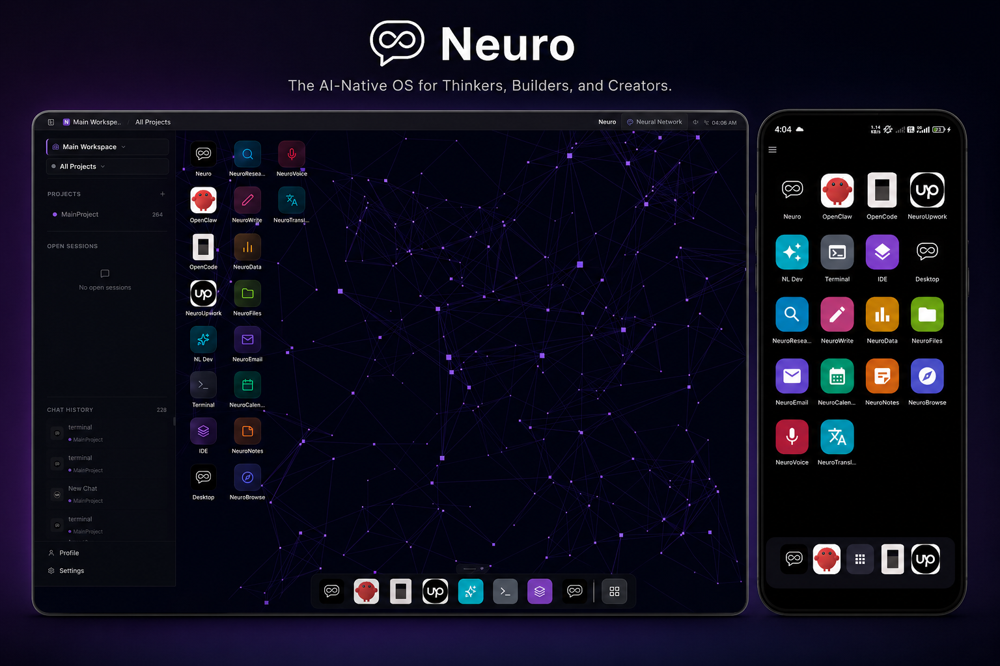

# Neurocomputer

> Programmable intelligence as composable engineering.
>
> Neurocomputer is an agentic OS for authoring, running, and visualizing AI systems built from a single modular unit — the **neuro**.

A neuro can be a model, a memory, a context, a prompt, a skill, a workflow, a tool-loop, or an agent. Compose them into agents, group agents into projects, group projects into agencies. One runtime, many surfaces: voice, web, mobile, IDE.

## The Trinity

Three names. One system. See [`docs/TRINITY.md`](./docs/TRINITY.md) for the canonical definition.

| | Role | What it is | Where |
|---|---|---|---|
| **NeuroLang** | the *language* | Typed Python primitives, plans-as-values, composition syntax. The thing you write in. | [`./neurolang/`](./neurolang/) (vendored) |
| **NeuroNet** | the *program* | A composed network of neuros — runnable, shareable, installable. The thing you ship. | Output of NeuroLang. Lives in `~/.neurolang/neuros/`. |
| **Neurocomputer** | the *environment* | IDE + execution environment + OS shell that hosts NeuroNets as apps. The thing you run on. | this repo |

NeuroLang is the **language**. NeuroNet is the **program**. Neurocomputer is the **environment** — write in NeuroLang, ship a NeuroNet, run on Neurocomputer.

### In Images



<!-- HERO IMAGES: Once generated, add side-by-side triptych here.
     See docs/hero-image-prompts.md for NeuroLang and NeuroNet prompts.
     Files go to: screenshots/neurolang_mobile_home.png and screenshots/neuronet_mobile_home.png
-->

## What you get

- **Voice agent** — STT/TTS loop over LiveKit, runs as a system service
- **3D Neuro IDE** — graph-native authoring of neuros (`@react-three/fiber`)
- **Multi-agent meeting rooms** — agents converse with a mediator, alternating turns
- **Scheduler** — cron-style triggers via `schedule_*` neuros + APScheduler
- **`agent.talk` primitive** — direct agent-to-agent messages with depth guard
- **Profiles** — swap behavior packs (`general`, `code_dev`, `neuro_dev`, `neurolang_dev`)
- **Mobile remote** — Android client for the same runtime
- **Neuro authoring** — `conf.json` + `code.py` + optional `prompt.txt` per unit, validated and hot-loadable
- **NeuroLang authoring agent (`nl_dev`)** — describe a flow in natural language, get a runnable Python neuro

## Quickstart

```bash
git clone git@github.com:neurocomputer-in/neurocomputer.git
cd neurocomputer
python3 -m venv .venv && source .venv/bin/activate
pip install -r neurocomputer/requirements.txt
pip install -e ./neurolang   # vendored framework
```

Create `.env` in repo root:

```dotenv
OPENAI_API_KEY=...
ELEVENLABS_API_KEY=...
SARVAM_API_KEY=...
LIVEKIT_URL=ws://localhost:7880
LIVEKIT_API_KEY=...
LIVEKIT_API_SECRET=...
```

Run backend, then web:

```bash
python neurocomputer/server.py             # http://127.0.0.1:7000
cd neuro_web && npm install && npm run dev # http://localhost:3000
```

Mobile:

```bash
cd neuro_mobile && ./gradlew assembleDebug
```

---

## For developers

### Hierarchy

The runtime is layered. Each level groups the next.

```text
Agency  ──▶  Project  ──▶  Agent  ──▶  Neuro
```

- **Agency** — top-level workspace (`Neuro HQ`, `Upwork`, `Web`). Color, emoji, set of agents, default project.
  - `core/agency.py`, `core/agency_configs.py`
- **Project** — a unit of work inside an agency. Default project ships with every agency.
  - `core/project.py`, `core/project_configs.py`, `core/defaults.py`
- **Agent** — role-specialized orchestrator (`neuro`, `nl_dev`, `opencode`, `openclaw`, `upwork`). Owns a router, planner, replier, profile.
  - `core/agent.py`, `core/agent_configs.py`, `core/agent_manager.py`
- **Neuro** — atomic capability. Discovered from `neurocomputer/neuros/`.
  - `core/neuro_factory.py`, `core/base_neuro.py`

### Neuro framework

The framework is split into orthogonal primitives, each backed by a base type and a folder of concrete neuros:

| Primitive | Purpose | Code |
|---|---|---|
| **Model** | provider/model abstraction, invocation | `core/model_neuro.py`, `core/llm_registry.py` |
| **Memory** | storage, retrieval, consolidation | `core/memory.py`, `core/memory_graph.py` |
| **Context** | typed packaging + I/O contracts | `core/context_neuro.py` |
| **Prompt** | prompt blocks + composition | `core/prompt_neuro.py` |
| **Skill** | discrete actionable capability | `neuros/skill/`, `core/instruction_neuro.py` |
| **Workflow** | DAG / sequential / parallel orchestration | `core/flows/{dag,sequential,parallel}_flow.py` |
| **Tool-loop** | in-reply tool calling and continuation | `core/tool_loop_neuro.py` |
| **Agent** | role-specialized orchestration | `core/agent_neuro.py` |

Routing, profile application, and session orchestration live in `core/brain.py`. The API surface is `neurocomputer/server.py`.

### Profiles

A profile is a behavior pack — model choice, system prompt, defaults — applied at the agent level. Shipped:

| Profile | Use |
|---|---|
| `general` | default conversational agent |
| `code_dev` | code-aware development |
| `neuro_dev` | authoring neuros inside Neurocomputer |
| `neurolang_dev` | authoring NeuroLang flows (paired with `nl_dev` agent) |

Switch via `POST /api/profile/switch`. Inspect with `GET /api/profile/active` and `GET /api/profile/list`.

### Multi-agent

**Meeting Rooms** — multiple agents share a transcript with a mediator picking the next speaker round-robin.
- `core/rooms.py`, `core/rooms_db.py`, neuros: `room_create`, `room_post`, `room_close`, `room_mediator`
- UI: `neuro_web/components/rooms/RoomPanel.tsx` — `/api/rooms`

**`agent.talk(target, msg)`** — abstract primitive for direct agent-to-agent messages. Depth-guarded (`MAX=4`) to prevent infinite loops.
- `core/talk.py`, neuros: `agent_talk`, `agent_list`

**Schedules** — cron-style triggers persisted to `schedules.db` via APScheduler.
- `core/scheduler.py`, `core/schedules_db.py`, `core/trigger_parse.py`
- Neuros: `schedule_run`, `schedule_cancel`, `schedule_list` — `/api/schedules`

### NeuroLang integration

NeuroLang is vendored at [`./neurolang/`](./neurolang/) (Phase 1.9, 172 tests passing). Install with `pip install -e ./neurolang`.

The `nl_dev` agent wraps NeuroLang's `compile_source` / `propose_plan` / `decompile_summary` through seven `nl_*` neuros:

- `nl_planner`, `nl_propose`, `nl_compile`, `nl_save`, `nl_run`, `nl_summary`, `nl_reply`

Compiled flows land in `~/.neurolang/neuros/`. See [`neurolang/README.md`](./neurolang/README.md) for the language itself.

### Authoring a neuro

Add a folder under `neurocomputer/neuros/<name>/` with:

1. `conf.json` — contract, description, metadata, kind
2. `code.py` — implementation (subclass of the appropriate base)
3. `prompt.txt` — optional, for LLM-driven neuros

Validate and run through the IDE backend or `core/neuro_factory.py`. Tests live in `neurocomputer/tests/`.

```bash
python3 neurocomputer/scripts/ide_server.py        # IDE backend, port 8000
cd neuro_web && NEXT_PUBLIC_IDE_URL=http://127.0.0.1:8000 npm run dev
# open http://localhost:3000/graph
```

### Repository layout

```text
.
├── neurocomputer/      # Python core: server, framework, neuros, profiles, tests
├── neuro_web/          # Next.js + R3F desktop client
├── neuro_mobile/       # Android (Kotlin/Compose) remote
├── neurolang/          # vendored NeuroLang library
├── experimental/       # prototypes
├── docs/               # architecture + product docs
└── STATUS.md           # current phase, last shipped, next up
```

### Dev workflow

```bash
cd neurocomputer
pytest                                                    # core tests
python neurocomputer/server.py                            # backend (7000)
python neurocomputer/scripts/ide_server.py                # IDE backend (8000)
cd neuro_web && npm run dev                               # web (3000)
cd neuro_web && npx playwright test                       # e2e
cd neuro_mobile && ./gradlew assembleDebug                # mobile
```

Optional local LiveKit:

```bash
cp neurocomputer/livekit.yaml.example livekit.yaml
livekit-server --config livekit.yaml
```

### Documentation

| Doc | What |
|---|---|
| [`STATUS.md`](./STATUS.md) | start here — current phase, last shipped, next up |
| [`docs/NeuroFramework.md`](./docs/NeuroFramework.md) | framework overview |
| [`docs/MULTI_AGENCY_ARCHITECTURE.md`](./docs/MULTI_AGENCY_ARCHITECTURE.md) | the 4-layer hierarchy |
| [`docs/MEMORY_ARCHITECTURE.md`](./docs/MEMORY_ARCHITECTURE.md) | memory model + graph |
| [`docs/AGENT_MEETING_ROOMS.md`](./docs/AGENT_MEETING_ROOMS.md) | rooms design |
| [`docs/superpowers/specs/`](./docs/superpowers/specs/) | per-shipped-feature specs |
| [`neurolang/docs/`](./neurolang/docs/) | NeuroLang language docs |
| [`neurocomputer/scripts/README_ide.md`](./neurocomputer/scripts/README_ide.md) | IDE backend |

## Status

Pre-alpha. APIs unstable. Personal-assistant scope: long-lived single-user, not multi-tenant.

## License

See [LICENSE](./LICENSE) where present, otherwise treat as all-rights-reserved pending publication.
