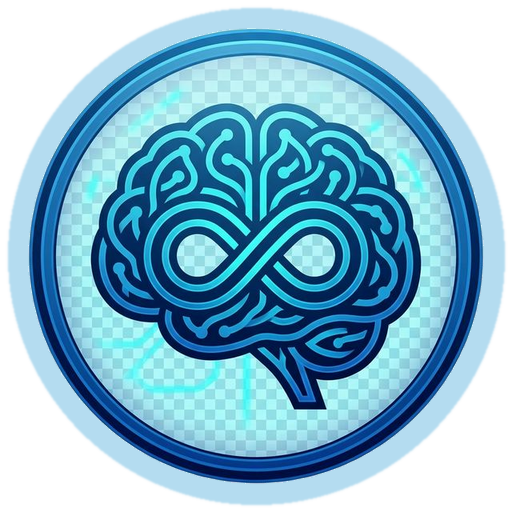
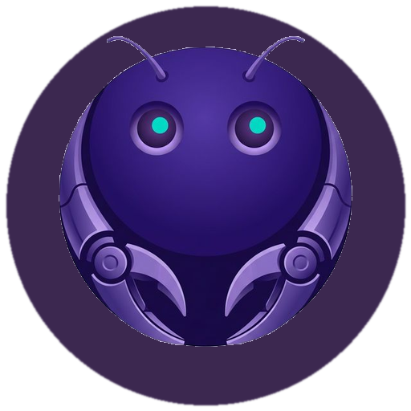
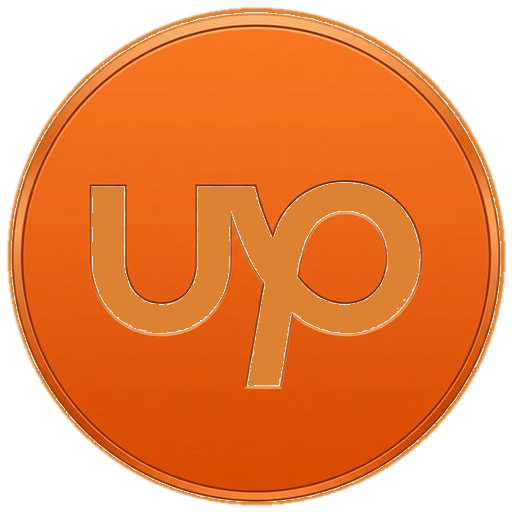

# Neurocomputer

**An AI-native computing ecosystem designed to bring the full power of a desktop into the palm of your hand.**

## The Vision

Neurocomputer is more than a remote desktop tool; it is a conceptual shift in how we interact with computers. The goal is to build a complete ecosystem where anything you can do sitting at a physical desktop can be done elegantly from a mobile application—driven entirely by specialized, open-source AI agents.

### Core Philosophy

1. **AI-Native Workflows**: The system treats AI agents as first-class citizens. Instead of bolting an AI onto an existing OS, the workspace is built to facilitate seamless interaction between the user, the agent, and the desktop environment.
2. **Secure Isolation (The Agent OS Concept)**: To ensure privacy and security, this environment runs optimally inside a private, isolated machine. You confidently drop only the files and context you want the agent to see into this environment, keeping your personal host OS safe and separate. 
3. **Prompt-to-Desktop (Research/Roadmap)**: Our ultimate vision involves autonomous visual reasoning. You issue a prompt on mobile, and the agent literally looks at the desktop screen, clicks, types, and operates the machine to fulfill your request, just like a human operator.

---

## Capabilities & Use Cases

### Smart Remote Control
Bridging the gap between mobile and desktop using ultra-low latency WebRTC streaming.
* **Responsive Visuals**: View your high-resolution desktop perfectly scaled on your mobile device.
* **Precision Control**: A glass-morphic touchpad layer allows relative mouse movement, scrolling, and clicking.
* **Hotkey Automation**: Access specialized tasks quickly through macro-style hotkeys designed for mobile thumbs.

### The Agent Lineup
Neurocomputer hosts a suite of specialized agents, each optimized for specific domains:

*  **Neuro (General)**: The core agentic framework. A highly capable general-purpose assistant that evaluates intents and intelligently routes requests to specific skills.
*  **OpenClaw**: A dedicated browser automation agent that physically browses the web, captures DOM trees, and interacts with web applications on your behalf.
*  **OpenCode**: An IDE-integrated coding agent built to navigate repositories, write code, and manage complex development tasks.
*  **NeuroUpwork**: A focused workflow agent that hunts for freelance jobs, analyzes postings for your skill fit, creates POC concepts, and drafts tailored proposals.

---

## Technical Infrastructure

Beneath the visionary UI is a robust backend engine. **Any developer can build new skills ("neuros") and plug them into the core framework.**

### The Brain (ReAct Loop)
The heart of Neuro is a Reason + Act engine:
1. **Smart Router**: Evaluates incoming text/voice requests and decides if they require direct answering or multi-step execution.
2. **Planner**: Breaks complex goals down into a Directed Acyclic Graph (DAG) of manageable node executions.
3. **Executor**: Runs hot-swappable plugins ("neuros") such as file reading, screenshot taking, or code writing.

### Voice & Streaming Pipeline
* **Real-time Voice**: Microphone input streams through a tuned Silero VAD into Sarvam Streaming STT, hitting the LLM interface and returning via ElevenLabs TTS.
* **Desktop Stream**: MSS captures the native screen on Linux (with Windows/Mac fallbacks), transmitting a dynamic VideoTrack via a local LiveKit server.

---

## Implementation Status vs. Roadmap

We are moving fast to make the vision a reality. Here is where the ecosystem currently stands.

### Currently Implemented
- [x] **Core ReAct Framework**: Brain, Agent Manager, and 50+ loadable modular skills.
- [x] **Mobile Agent UI**: Beautiful, immersive Android application with agent selection, chat histories, and voice typing.
- [x] **Remote PC Streaming**: Low-latency video track delivery of the desktop display context over WebRTC.
- [x] **Smart Remote Inputs**: Configurable mouse touchpad overlay, full keyboard access, and multi-monitor switching capabilities.
- [x] **Multi-Agent Architecture**: Discrete profiles for Neuro, OpenClaw, OpenCode, and Upwork parsing.

### Research & Roadmap (To-Do)
- [ ] **Autonomous Vision-Action Loop**: Integrating vision-language models capable of analyzing screen captures to auto-drive the desktop based on high-level prompts.
- [ ] **Seamless File Sandboxing**: Better cross-platform tooling to seamlessly "drop" files into the isolated OS environment from mobile.
- [ ] **Expanded Mobile Hotkeys**: Customizable macros in the draggable toolbar to speed up common professional tasks.
- [ ] **Offline Execution Features**: Migrating key reasoning layers to extremely efficient local LLMs to prevent reliance on cloud APIs.

---

## Running the Ecosystem Locally

### Requirements
* Python 3.11+
* Local LiveKit server (for WebRTC signaling)
* TURN Server (for remote network traversal)

### Quick Start

1. Clone and install dependencies:
```bash
git clone https://github.com/neurocomputer-in/neurocomputer.git
cd neurocomputer
python3 -m venv venv && source venv/bin/activate
pip install -r requirements.txt
```

2. Configure environment (API Keys):
```bash
cp livekit.yaml.example livekit.yaml
# Add OPENAI_API_KEY, ELEVENLABS_API_KEY, SARVAM_API_KEY to a `.env` file
```

3. Run servers:
```bash
livekit-server --config livekit.yaml & 
python server.py
```

4. Build and deploy the Android App:
```bash
cd neuro_mobile_app
./gradlew assembleDebug 
```
*(Point the mobile app's server configuration to `http://<your-machine-ip>:8000`)*
